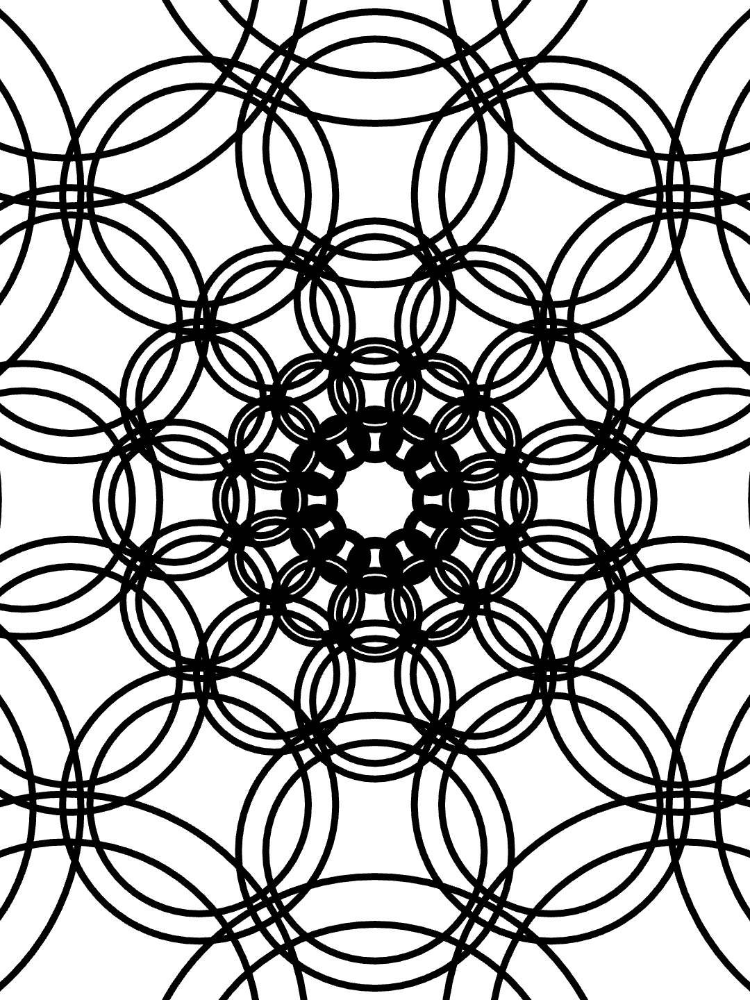

# Day 1

Prompt: **One color, one shape.**

one colour? need two colours by default. ground + 1 colour, then.

one shape.
circle
triangle
square
rectangle
polygon
hexagon
octagon

prompts

tiling
grid
overlapping
interlocking
offset
static
dynamic
motion

## Output

### Posted

### Alternates

